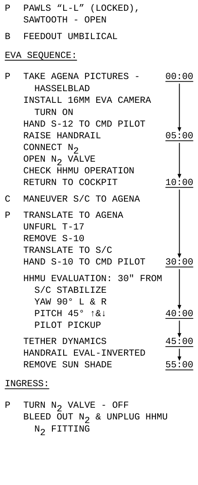
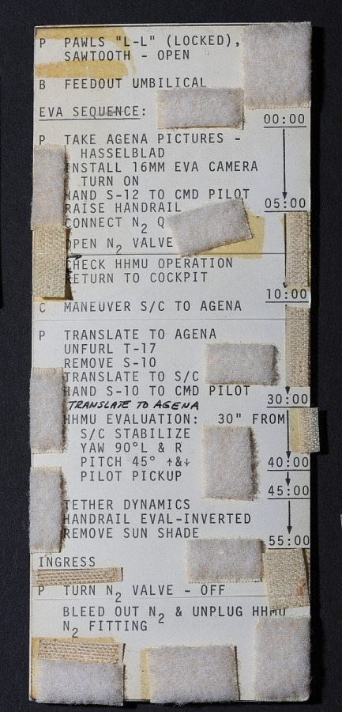

# EVA Checklist

A Typst template for creating NASA Gemini (1966) style checklists. See comparison with original below:

|               Template                |                    NASA Gemini                     |
| :-----------------------------------: | :------------------------------------------------: |
|  |  |

[NASA Image Source](https://airandspace.si.edu/collection-objects/checklist-card-umbilical-eva-gemini-10/nasm_A19850125000)

### Features:

- Sequence with heading
- Time scale axis
- Crew identifier (Pilot, copilot, both etc.)
- Step
- Sub Step
- Numbered steps as seen in other Gemini checklists such as [gemini-5](https://www.thespacecollective.com/complete-gemini-5-flown-checklist)

## Start with

```typst
#import "../lib.typ": *
#show: checklist
```

See `examples/` for help.
All sequence titles and steps have forced capitalisation.

### Sequence

Starts a new sequence, the title and time axis are optional.

```typst
#sequence(title: "Eva Sequence")[
  #withCrew("P")[
  //...steps
  ]
]
// With an optional time axis
#sequence(title: "Eva Sequence", withTime: true)[
  // rest of sequence
]
// With optional numbered steps.
#sequence(title: "Eva Sequence", withNumbers: true)[
  // rest of sequence
]
```

### Crew

Specifies the crew letter in the left hand margin.

```typst
 #withCrew("P")[
  // ... steps
 ]
```

### Step

Specifies an individual step. Optional `atTime` parameter if using time axis.

```typst
#step[Take Agena pictures - Hasselblad]
#step(atTime: "05:00")[Raise handrail]
```

### Sub step

A step with a left indentation. Optional `atTime` parameter if using time axis.

```typst
#subStep[YAW 90#sym.degree L & R]
#subStep(atTime: "40:00")[Pitch 45]
```
